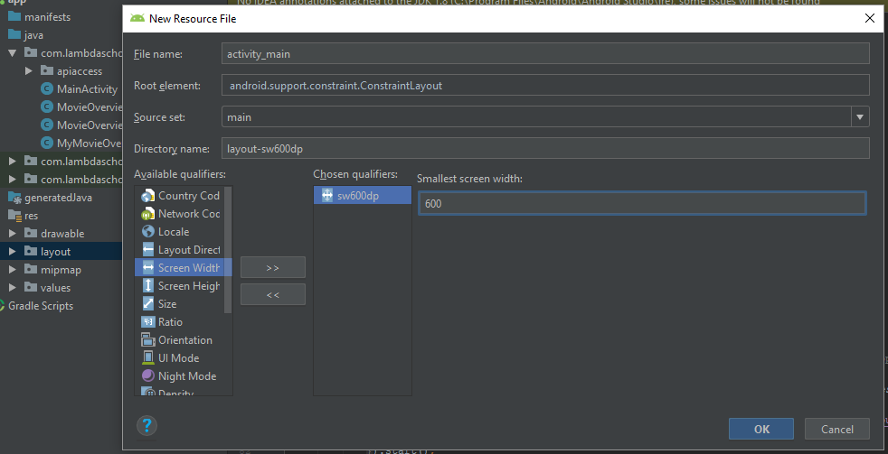

# Android_Fragments_Basics

## Introduction

This app is designed to demonstrate and reinforce the use of fragments in apps.

## Instructions

### Part 1 - Project Data

This is very open ended. Build a source of data for your project, this can be hard coded data, user entered data, data from a network API, or any other source, we just need data. This will need to contain at least a data class which implements `Serializable` and a list of values.

### Part 2 - List Fragment

We'll now create a fragment to list our data.
1. In your project tab on the left, right click the package name and go to new -> fragment -> Fragment(list)
2. There will be a popup window. In that window, replace the value for "Object Kind" with the name of your data object. Note the names of the files it will be creating. Click finish.
3. You'll see that this will now generate a number of classes and files. In your project tab there is now a new package called `dummy` delete that package and the files it contains.
4. First, open the New fragment file. You'll see some red error messages.
5. In the generated fragment class, you'll see around line 72 a constructor for the generated list adapter class. You'll need to change the `DummyItem` to your data class. Once that is done follow the constructor to the RecyclerViewAdapter class
6. Adjust this class and the corresponding layout to work with your data object.
7. You'll see around line 47 a call to `onListFragmentInteraction` along with another error. You'll need to change the signature of that method (found in the new fragment class) to accept your data object

### Part 3 - Attach List Fragment to MainActivity

1. In your MainActivity layout replace the `TextView` with a `fragment` view add a `name` attribute and set the value as the full package name for your fragment
2. In the java file. Implement the `OnListFragmentInteractionListener` from your ListFragment and implement the method. This is where you'll build and attach your second fragment. You can use the passed in data object to pass along to the details page

### Part 4 - Add a second fragment for tablets
1. Create a new `activity_main` layout for displays with the `smallest screen width` of 600dp

2. Copy your old layout to this one. Add a `FrameLayout` for your details fragment, be sure to include an id and size it how you want both fragments to appear
3. Create another new fragment, but this time select `Fragment (Blank)`DetailsFragment
4. In the new layout, add fields to display your data
5. In the MainActivity's `OnListFragmentInteractionListener` Create a new instance of your detail fragment.
> You'll also need to implement that fragment's `OnListFragmentInteractionListener` interface and method

6. Create a new `Bundle` object and put your serializable data object into it (the one passed in the current method's signature)
7. Call `setArguments` on your fragment and pass it your bundle.
8. Start a fragment transaction with `getSupportFragmentManager().beginTransaction()` then use the builder pattern to call `replace` and pass it your Frame layout id, and the fragment object, then call `commit()`
9. In the detail fragment, call `getArguments` to get the bundle object and then `getSerializable` to get your data object (be sure to cast it to your class)
10. Use that object to populate your view

### Part 5 - Add a second activity for phones
1. Create a new activity like the main activity with a `FrameLayout` view and in the new activity's `onCreate` method add the detail fragment programatically like you did in steps 5-8 in part 4
2. Now we need to determine if the device is big enough for two panels
3. Create a new `attr.xml`file. Add a new bool field called `is_tablet` set the value to false
4. Create another `attr.xml` file, but this time, create it with the same requirement you set in Step 4.1. Add the same bool field but set its value to true
5. In your main activity's `OnListFragmentInteractionListener`, call `getResources().getBoolean(R.bool.is_tablet)` to get that value. If it is true, add your fragment as in part 4. If not, create an intent and use it to start the second activity, passing your data object as well.

#### Challenge

Change the detail activity to be a popup diaplog instead of a separate activity or screen.
